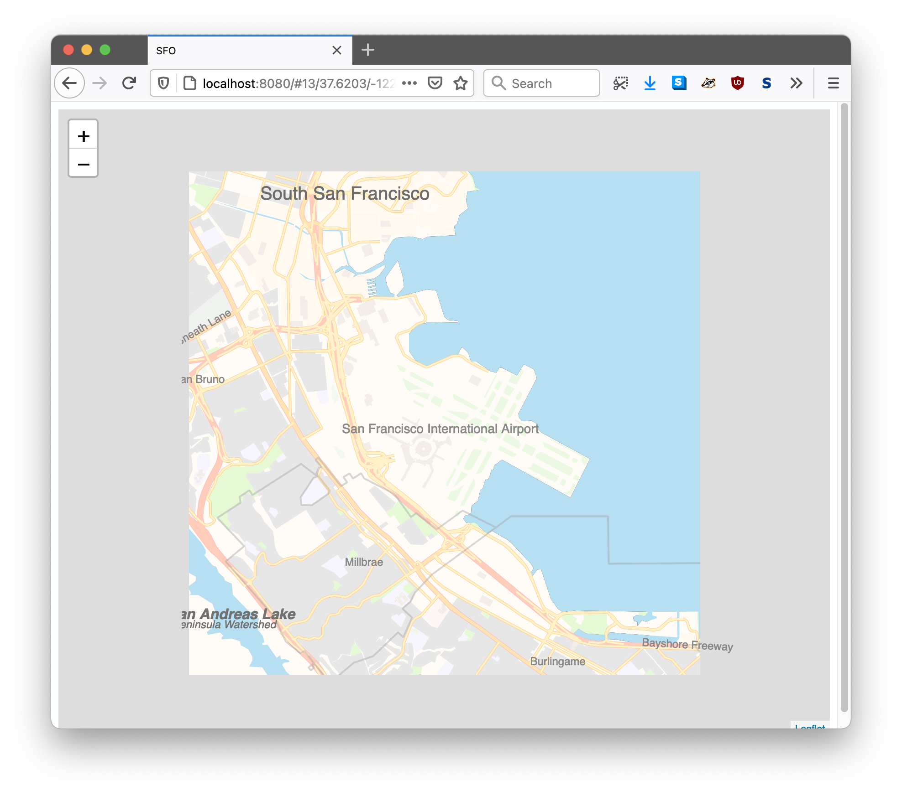

# go-http-leaflet-protomaps

Go HTTP middleware for the Protomaps Leaflet package.

## Documentation

Documentation remains to be written. In the meantime have a look at the [cmd/example/main.go](cmd/example/main.go) application.

## See also

* https://protomaps.com/blog/new-way-to-make-maps/
* https://github.com/protomaps/protomaps.js
